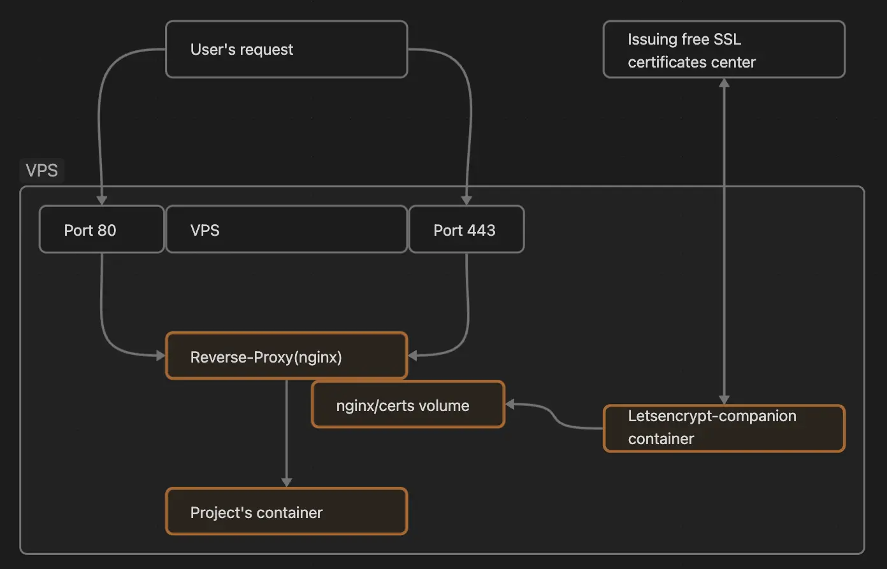

- [Starting Off with a VPS](#starting-off-with-a-vps)
- [Setting Up Docker](#setting-up-docker)
- [Getting Your Project Ready](#getting-your-project-ready)
- [Run it on VPS](#run-it-on-vps)
- [Wrap-Up](#wrap-up)

In this post, I'm excited to share how I built my own blog-experiment-lab-website from scratch using a VPS (Virtual Private Server) and Docker. I wanted to understand how these projects work by doing everything myself. This article might help you if you're looking to do something similar.

## Starting Off with a VPS

First, you'll need a VPS. If you want your project to have a domain name, you can either buy one or use a free one from your VPS provider. If you buy one, you'll need to set it up to point to your VPS. Also, make sure to open the ports you need and secure the ones you don't with a Firewall. A good security step is to use something like Fail2Ban.

When you get your VPS, you'll start with a root user account. It's not safe to use this for everything, so you'll want to make a new user. I did this with a simple command:
```bash
adduser username
```

You can check if the new user is created with another command:
```bash
grep '^username' /etc/passwd
```

## Setting Up Docker

Next up is installing Docker. You can find step-by-step instructions on its official [website](https://docs.docker.com/engine/install/ubuntu/). Don't forget to add your new user to the Docker group with a command:
```bash
usermod -aG docker your_username
```
Then, refresh your group membership with this command:
```bash
newgrp docker
```

## Getting Your Project Ready

Now for the project part. I used Astro for my static website. You need a Dockerfile to tell Docker how to build your project's image:
```yml
# BUILD STAGE
FROM node:lts-alpine as build  # use nodejs alpine image and assign it name "build" to use it in production stage
WORKDIR /app  # create work directory
COPY package*.json ./  # copy package.json and package-lock.json from project to work directory
RUN npm install  # install dependencies
COPY . .  # copy source code from project to work directory
RUN npm run build  # build project

# PRODUCTION STAGE
FROM nginx:stable-alpine as production  # use nginx alpine image
COPY --from=build /app/dist /usr/share/nginx/html  # using name of the image from previous stage copy bundle to nginx serving directory
EXPOSE 80  # expose port 80 so you can connect to nginx outside the container
CMD ["nginx", "-g", "daemon off;"]  # run nginx
```

If you're using a different package manager than npm, remember to include its .lock file by adding an extra COPY step in the Dockerfile. You can learn why turning off "daemon" is important for nginx images [here](https://github.com/blockloop/docker-alpine-nginx/blob/master/README.md#:~:text=Make%20sure%20you%20start%20nginx%20without%20daemon%20mode%2C%20by%20including%20daemon%20off%3B%20in%20your%20nginx%20configuration%2C%20otherwise%20the%20container%20will%20constantly%20exit%20right%20after%20nginx%20starts.)

## Run it on VPS

To run your project on the VPS, you need a docker-compose.yml file. This file tells Docker how to set up your project to make it available from outside your VPS. For my Astro website, I needed three things: a reverse-proxy to manage incoming requests, a letsencrypt-companion for SSL certificates, and a container for my website:
```yml
services:
  nginx:
    container_name: nginx
    image: nginxproxy/nginx-proxy
    restart: unless-stopped
    ports:
      - 80:80
      - 443:443
    volumes:
      - /var/run/docker.sock:/tmp/docker.sock:ro
      - ./nginx/html:/usr/share/nginx/html
      - ./nginx/certs:/etc/nginx/certs
      - ./nginx/vhost:/etc/nginx/vhost.d
    logging:
      options:
        max-size: "10m"
        max-file: "3"

  letsencrypt-companion:
    container_name: letsencrypt-companion
    image: jrcs/letsencrypt-nginx-proxy-companion
    restart: unless-stopped
    volumes_from:
      - nginx
    volumes:
      - /var/run/docker.sock:/var/run/docker.sock
      - ./nginx/acme:/etc/acme.sh
    env_file:
      - email.env
  frontend:
    container_name: frontend
    build: .
    env_file:
      - hosts.env
```
You'll also need to create two files in the same folder as your docker-compose.yml:

email.env:
```bash
DEFAULT_EMAIL=test@mail.com
```
and hosts.env:
```bash
VIRTUAL_HOST=example.com
LETSENCRYPT_HOST=example.com
```
This setup lets you host your project on any VPS with Docker:



Finally, to get your project running, just pull it to your VPS from your git repository, go to the project's directory, and run a command:
```bash
docker compose up -d
```
The ```-d{:bash}``` flag means it will run in the background, so you can close the terminal, and it will keep going.

## Wrap-Up
With this setup, you can easily move your project to any server that has Docker. You can also start thinking about how to automatically deploy to your VPS whenever you make changes to your project. I'll cover that topic in the next post. Stay tuned!
